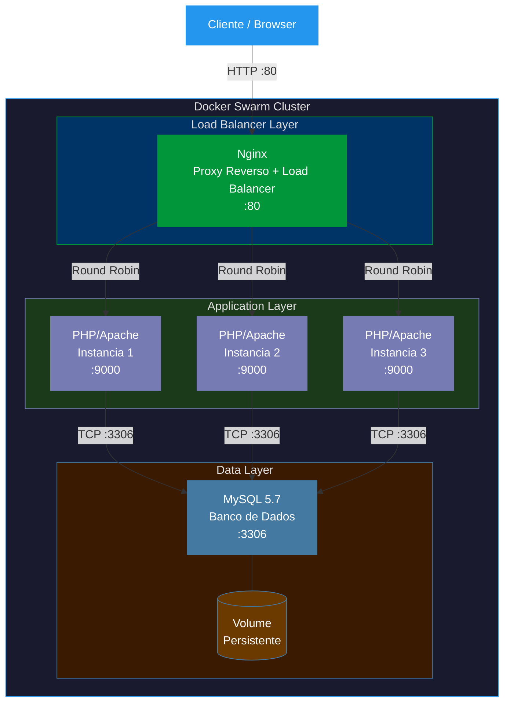
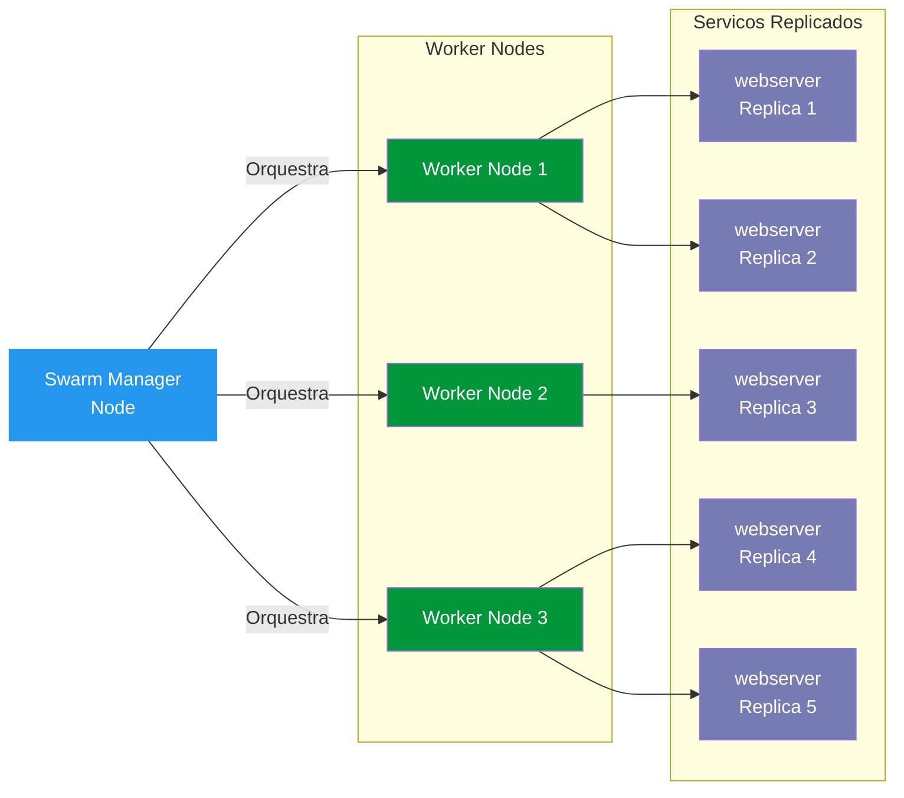

# Docker: Utilizacao Pratica no Cenario de Microsservicos
# Docker: Practical Usage in Microservices Scenarios

<div align="center">

[](https://www.docker.com/)
[](https://docs.docker.com/compose/)
[](https://docs.docker.com/engine/swarm/)
[](https://nginx.org/)
[](https://www.php.net/)
[](https://www.mysql.com/)
[](LICENSE)

</div>

---

## Portugues (PT-BR)

### Descricao

Projeto pratico do bootcamp **Microsoft Azure Advanced #2** da DIO, focado na utilizacao do Docker para implementar uma arquitetura de microsservicos. O projeto demonstra como containerizar aplicacoes, orquestrar multiplos servicos com Docker Compose e utilizar Docker Swarm para escalabilidade.

---

### Arquitetura

A arquitetura consiste em:
- **Nginx** como proxy reverso e load balancer
- **App PHP/Apache** como servico web principal
- **MySQL** como banco de dados relacional
- **Docker Swarm** para orquestracao do cluster

#### Diagrama de Arquitetura



#### Fluxo do Docker Swarm



---

### Tecnologias

| Tecnologia | Versao | Funcao |
|---|---|---|
| Docker | Latest | Containerizacao |
| Docker Compose | Latest | Orquestracao local |
| Docker Swarm | Built-in | Cluster em producao |
| Nginx | Latest | Proxy reverso e load balancer |
| PHP | 7.4 | Linguagem da aplicacao web |
| Apache | Built-in | Servidor HTTP |
| MySQL | 5.7 | Banco de dados relacional |
| Linux | Ubuntu/Debian | Sistema operacional base |

---

### Estrutura do Projeto

```
docker-microservices-project/
|-- docker-compose.yml       # Definicao dos servicos e redes
|-- nginx/
|   |-- nginx.conf           # Configuracao do proxy reverso e load balancer
|-- app/
|   |-- Dockerfile           # Imagem customizada PHP/Apache
|   |-- index.php            # Pagina principal da aplicacao
|-- mysql/
|   |-- init.sql             # Script de inicializacao do banco
|-- README.md
```

---

### Como Executar

#### Pre-requisitos
- Docker instalado ([guia oficial](https://docs.docker.com/get-docker/))
- Docker Compose instalado ([guia oficial](https://docs.docker.com/compose/install/))

#### Execucao com Docker Compose

```bash
# Clonar o repositorio
git clone https://github.com/galafis/docker-microservices-project.git
cd docker-microservices-project

# Subir os servicos em modo detached
docker-compose up -d

# Verificar containers em execucao
docker container ls

# Ver logs dos servicos
docker-compose logs -f

# Acessar a aplicacao
# http://localhost:80

# Parar os servicos
docker-compose down

# Parar e remover volumes
docker-compose down -v
```

#### Docker Swarm — Cluster em Producao

```bash
# Inicializar o Swarm no node manager
docker swarm init

# Criar o servico com 3 replicas
docker service create --name webserver --replicas 3 -p 80:80 nginx

# Listar servicos ativos
docker service ls

# Ver detalhes de um servico
docker service inspect webserver --pretty

# Escalar servico para 5 replicas
docker service scale webserver=5

# Ver distribuicao das tarefas pelos nodes
docker service ps webserver

# Remover o servico
docker service rm webserver

# Sair do Swarm
docker swarm leave --force
```

---

### Conceitos Aplicados

- Containerizacao de aplicacoes com Docker
- Orquestracao local com Docker Compose
- Proxy reverso e balanceamento de carga com Nginx
- Persistencia de dados com volumes Docker
- Redes Docker customizadas e isolamento de servicos
- Cluster de alta disponibilidade com Docker Swarm
- Replicacao e escalabilidade horizontal de servicos
- Stress testing de containers e limites de recursos

---

## English

### Description

Practical project from the **Microsoft Azure Advanced #2** bootcamp by DIO, focused on using Docker to implement a microservices architecture. The project demonstrates how to containerize applications, orchestrate multiple services with Docker Compose, and use Docker Swarm for scalability and high availability.

---

### Architecture Overview

The architecture is composed of:
- **Nginx** as the reverse proxy and load balancer
- **PHP/Apache App** as the main web service (horizontally scalable)
- **MySQL** as the relational database backend
- **Docker Swarm** for cluster orchestration and service replication

The Nginx layer receives all incoming HTTP traffic on port 80 and distributes requests across PHP/Apache instances using a round-robin strategy. Each PHP instance connects to the shared MySQL database through an isolated Docker network, and data is persisted via a Docker volume that survives container restarts.

---

### Technologies

| Technology | Version | Role |
|---|---|---|
| Docker | Latest | Containerization engine |
| Docker Compose | Latest | Local orchestration |
| Docker Swarm | Built-in | Production cluster |
| Nginx | Latest | Reverse proxy and load balancer |
| PHP | 7.4 | Web application language |
| Apache | Built-in | HTTP server |
| MySQL | 5.7 | Relational database |
| Linux | Ubuntu/Debian | Base OS for containers |

---

### Project Structure

```
docker-microservices-project/
|-- docker-compose.yml       # Service and network definitions
|-- nginx/
|   |-- nginx.conf           # Reverse proxy and load balancer config
|-- app/
|   |-- Dockerfile           # Custom PHP/Apache image
|   |-- index.php            # Main application page
|-- mysql/
|   |-- init.sql             # Database initialization script
|-- README.md
```

---

### How to Run

#### Prerequisites
- Docker installed ([official guide](https://docs.docker.com/get-docker/))
- Docker Compose installed ([official guide](https://docs.docker.com/compose/install/))

#### Run with Docker Compose

```bash
# Clone the repository
git clone https://github.com/galafis/docker-microservices-project.git
cd docker-microservices-project

# Start services in detached mode
docker-compose up -d

# Check running containers
docker container ls

# Follow service logs
docker-compose logs -f

# Access the application
# http://localhost:80

# Stop services
docker-compose down

# Stop and remove volumes
docker-compose down -v
```

#### Docker Swarm — Production Cluster

```bash
# Initialize Swarm on the manager node
docker swarm init

# Create a service with 3 replicas
docker service create --name webserver --replicas 3 -p 80:80 nginx

# List active services
docker service ls

# Inspect a service
docker service inspect webserver --pretty

# Scale service to 5 replicas
docker service scale webserver=5

# View task distribution across nodes
docker service ps webserver

# Remove the service
docker service rm webserver

# Leave the Swarm
docker swarm leave --force
```

---

### Key Concepts Applied

- Application containerization with Docker
- Local multi-service orchestration with Docker Compose
- Reverse proxying and load balancing with Nginx
- Data persistence with Docker volumes
- Custom Docker networks and service isolation
- High availability cluster with Docker Swarm
- Horizontal scaling and service replication
- Container resource limits and stress testing

---

## Licenca / License

Este projeto esta licenciado sob a **Licenca MIT**.
This project is licensed under the **MIT License**.

```
MIT License

Copyright (c) 2024 Gabriel Demetrios Lafis

Permission is hereby granted, free of charge, to any person obtaining a copy
of this software and associated documentation files (the "Software"), to deal
in the Software without restriction, including without limitation the rights
to use, copy, modify, merge, publish, distribute, sublicense, and/or sell
copies of the Software, and to permit persons to whom the Software is
furnished to do so, subject to the following conditions:

The above copyright notice and this permission notice shall be included in all
copies or substantial portions of the Software.

THE SOFTWARE IS PROVIDED "AS IS", WITHOUT WARRANTY OF ANY KIND, EXPRESS OR
IMPLIED, INCLUDING BUT NOT LIMITED TO THE WARRANTIES OF MERCHANTABILITY,
FITNESS FOR A PARTICULAR PURPOSE AND NONINFRINGEMENT. IN NO EVENT SHALL THE
AUTHORS OR COPYRIGHT HOLDERS BE LIABLE FOR ANY CLAIM, DAMAGES OR OTHER
LIABILITY, WHETHER IN AN ACTION OF CONTRACT, TORT OR OTHERWISE, ARISING FROM,
OUT OF OR IN CONNECTION WITH THE SOFTWARE OR THE USE OR OTHER DEALINGS IN THE
SOFTWARE.
```

---

## Autor / Author

**Gabriel Demetrios Lafis**
- GitHub: [@galafis](https://github.com/galafis)
- LinkedIn: [galafis](https://www.linkedin.com/in/galafis/)

---

*Projeto desenvolvido como parte do bootcamp Microsoft Azure Advanced #2 - DIO*
*Project developed as part of the Microsoft Azure Advanced #2 bootcamp - DIO*
